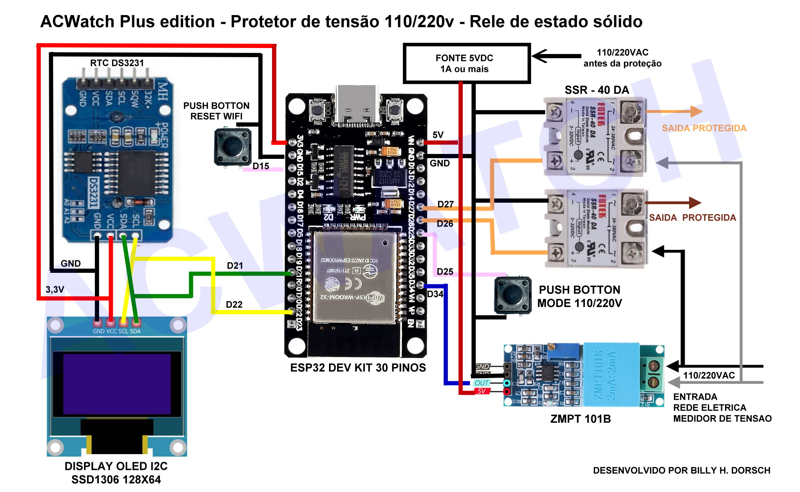
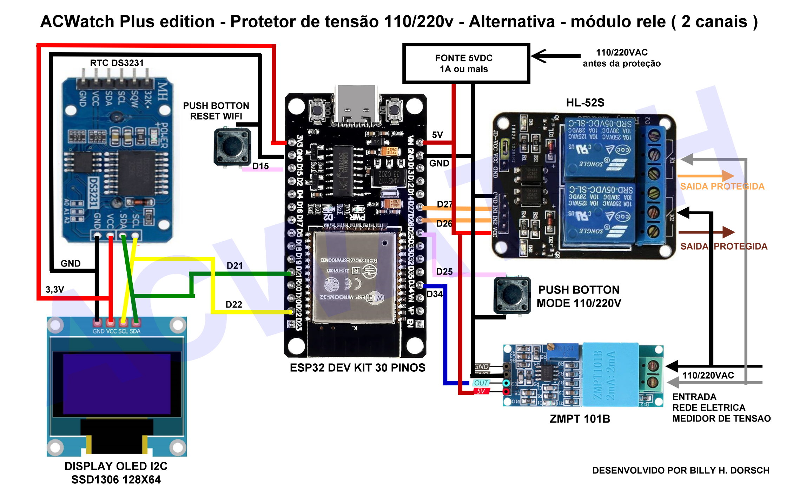

📝 ACWatch – Protetor de Tensão Inteligente com Monitoramento Web

Bem-vindo ao repositório oficial do ACWatch, um sistema de proteção elétrica com alma de engenharia! Baseado em ESP32, oferece monitoramento web, controle de relé, RTC, interface intuitiva e possibilidade de expansão com sensores.

🔧 Funcionalidades Principais
⚡ Proteção Ativa: desliga automaticamente quando a tensão sai dos limites seguros

🧠 Religamento Inteligente: espera estabilidade antes de reconectar

🌐 Interface Web: controle via celular ou PC com ajuste de hora, Wi-Fi e histórico

📟 Display OLED (versão Plus): exibição direta de tensão e estado

📘 RTC com bateria: preserva horário e logs após quedas de energia

## 🌱 ACWatch ECO (Versão ESP32-C3 Mini)

> ⚠️ Esta versão está em desenvolvimento e ainda não foi testada em hardware físico.  
> Estrutura simplificada, sem display e RTC físico. Com LEDs indicadores e interface web NTP/manual.

📁 Localização: `ACWatch-Eco-C3-Mini/`

[ACWatch-ESP32-C3-Docs.html](ACWatch-Eco-C3-Mini/ACWatch-ESP32-C3-Docs.html) — Interface Web modo Eco

**Principais características:**

- ✅ LEDs indicadores de tensão (110V, 220V) e alerta de falha (opcional Buzzer )
- 🌐 Interface Web completa:
  - Atualização automática da hora via NTP
  - Ajuste manual de hora via navegador em modo offline (Access point)
- ❌ Sem RTC externo e sem display OLED

---

### 🔍 Comparativo entre versões: ACWatch Plus vs ACWatch Eco

| Característica               | ACWatch Plus (DevKit/OLED) | ACWatch Eco (ESP32-C3 Mini)     |
|-----------------------------|-----------------------------|----------------------------------|
| 🧠 RTC físico com bateria    | ✅ Sim                      | ❌ Não                            |
| 📟 Display OLED              | ✅ Sim                      | ❌ Não                            |
| 🔌 LEDs indicadores          | ❌ Não                      | ✅ Sim                            |
| 🔊 Alerta com buzzer         | ❌ Não                      | ✅ Opcional                       |
| 🌐 Interface Web             | ✅ Completa                 | ✅ Completa                       |
| 📡 Atualização da hora       | ✅ RTC / NTP                | ✅ NTP / manual via navegador     |
| ⚙️ Controle de relé          | ✅ Sim                      | ✅ Sim                            |
| 📦 Tamanho da placa          | Grande (DevKit)            | Compacta (Mini)                  |
| 🧪 Estado do projeto         | ✅ Testado em hardware      | ⚠️ Em desenvolvimento            |

---

🖼️ Esquemas Elétricos
---

### 🔌 Esquema ACWatch com Relé SSR

  

<em>Figura 1 – Versão com relé SSR e RTC, ideal para acionamentos silenciosos e alta durabilidade.</em>

---

### ⚙️ Esquema ACWatch com Módulo de 2 Relés Mecânicos

  

<em>Figura 2 – Versão utilizando módulo de 2 relés mecânicos com controle separado por GPIOs.</em>

🚀 Como Usar – Passos Iniciais
Ligue o ACWatch pela primeira vez (ou após reset Wi-Fi)

Conecte-se à rede Wi-Fi criada:

SSID: ACWatch_AP

Senha: 12345678

Acesse o painel via navegador:

IP: http://192.168.4.1

📂 Arquivos Importantes

ACWatch-ESP32-DevKit-Docs.html — Interface Web completa

ACWatch-ESP32-C3-Docs.html — Interface Web modo Eco

📡 Recomendações para Radioamadores

Filtro EMI na entrada

Relés SSR com Zero-Crossing

Circuito Snubber nos relés comuns

🛠️ Próximas Versões

[x] ACWatch V5: ✅ Concluída e funcional

[ ] ACWatch V6: ⚙️ Sensores de temperatura, umidade e corrente (em desenvolvimento)

📜 Licença

Projeto de código aberto. Use, modifique, compartilhe e melhore! Créditos Billy Dorsch
