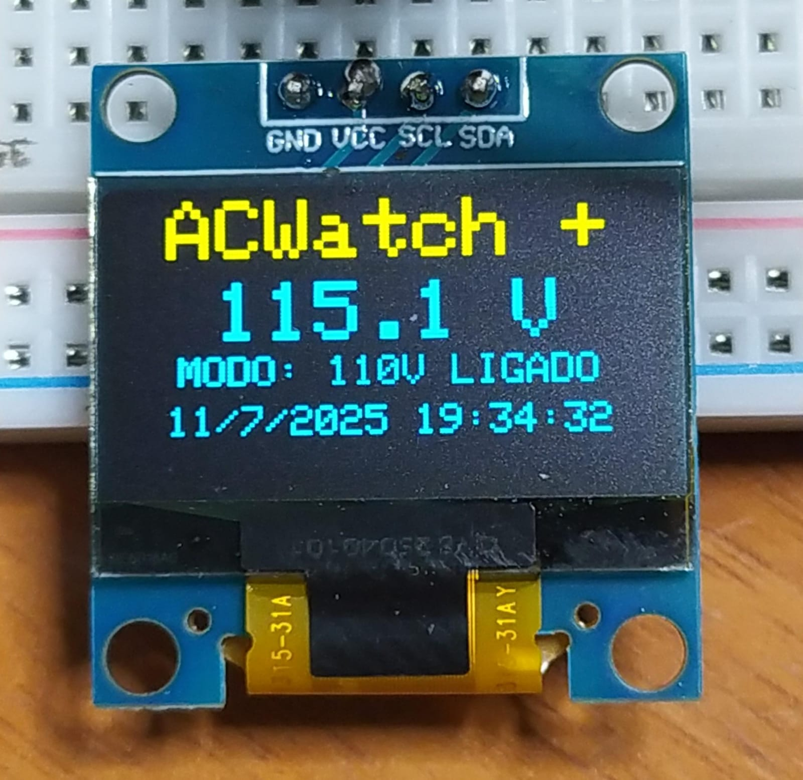
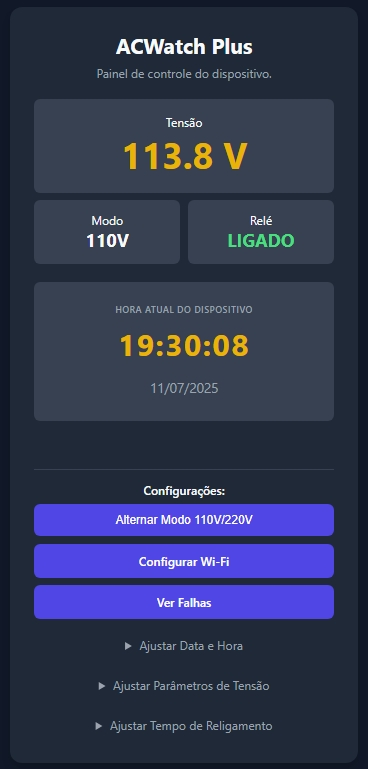
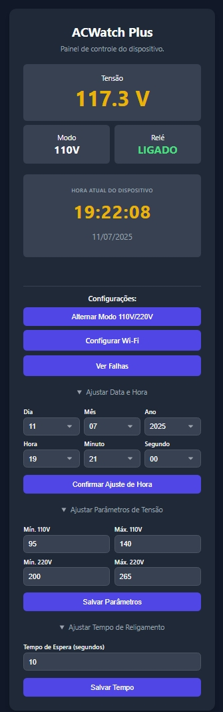
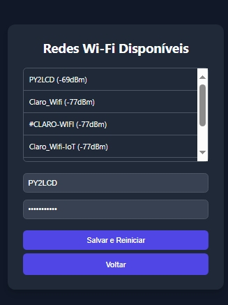
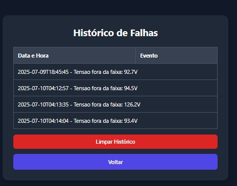

📝 ACWatch – Protetor de Tensão Inteligente com Monitoramento Web

Bem-vindo ao repositório oficial do ACWatch, um sistema de proteção elétrica com alma de engenharia! Baseado em ESP32, oferece monitoramento web, controle de relé, RTC, interface intuitiva e possibilidade de expansão com sensores.

⚠️ Nível de Dificuldade: Médio
Este projeto requer conhecimentos básicos de eletrônica e programação. A montagem envolve solda e manipulação da rede elétrica. Além disso, para uma leitura precisa da tensão, são necessários ajustes finos no código (calibração) e no trimpot do sensor ZMPT101B.

🔧 Funcionalidades Principais
⚡ Proteção Ativa: desliga automaticamente quando a tensão sai dos limites seguros

🧠 Religamento Inteligente: espera estabilidade antes de reconectar

🌐 Interface Web: controle via celular ou PC com ajuste de hora, Wi-Fi e histórico

📟 Display OLED (versão Plus): exibição direta de tensão e estado

📘 RTC com bateria: preserva horário e logs após quedas de energia

## 🌱 ACWatch ECO (Versão ESP32-C3 Mini)

> ⚠️ Esta versão está em desenvolvimento e ainda não foi testada em hardware físico.  
> Estrutura simplificada, sem display e RTC físico. Com LEDs indicadores e interface web NTP/manual.

📁 Localização: `ACWatch-Eco-C3-Mini/`

[ACWatch-ESP32-C3-Docs.html](ACWatch-Eco-C3-Mini/ACWatch-ESP32-C3-Docs.html) — Interface Web modo Eco

**Principais características:**

- ✅ LEDs indicadores de tensão (110V, 220V) e alerta de falha (opcional Buzzer )
- 🌐 Interface Web completa:
  - Atualização automática da hora via NTP
  - Ajuste manual de hora via navegador em modo offline (Access point)
- ❌ Sem RTC externo e sem display OLED

---

### 🔍 Comparativo entre versões: ACWatch Plus vs ACWatch Eco

| Característica               | ACWatch Plus (DevKit/OLED) | ACWatch Eco (ESP32-C3 Mini)     |
|-----------------------------|-----------------------------|----------------------------------|
| 🧠 RTC físico com bateria    | ✅ Sim                      | ❌ Não                            |
| 📟 Display OLED              | ✅ Sim                      | ❌ Não                            |
| 🔌 LEDs indicadores          | ❌ Não                      | ✅ Sim                            |
| 🔊 Alerta com buzzer         | ❌ Não                      | ✅ Opcional                       |
| 🌐 Interface Web             | ✅ Completa                 | ✅ Completa                       |
| 📡 Atualização da hora       | ✅ RTC / NTP                | ✅ NTP / manual via navegador     |
| ⚙️ Controle de relé          | ✅ Sim                      | ✅ Sim                            |
| 📦 Tamanho da placa          | Grande (DevKit)            | Compacta (Mini)                  |
| 🧪 Estado do projeto         | ✅ Testado em hardware      | ⚠️ Em desenvolvimento            |

---

🖼️ Esquemas Elétricos
---

### 🔌 Esquema ACWatch+ com Relé SSR

  

<em>Figura 1 – Versão com relé SSR e RTC, ideal para acionamentos silenciosos e alta durabilidade.</em>

---

### ⚙️ Esquema ACWatch+ (ALTERNATIVO) com Módulo de 2 Relés Mecânicos

  

<em>Figura 2 – Versão utilizando módulo de 2 relés mecânicos com controle separado por GPIOs.</em>

🚀 Como Usar – Passos Iniciais
Ligue o ACWatch pela primeira vez (ou após reset Wi-Fi)

Conecte-se à rede Wi-Fi criada:

SSID: ACWatch_AP

Senha: 12345678

Acesse o painel via navegador:

IP: http://192.168.4.1

🖼️ Galeria de Imagens
Uma visão geral do projeto em funcionamento, desde o display físico até a interface web completa.

Display OLED em Ação (Versão Plus)

<em>Display OLED da versão "Plus" em pleno funcionamento, exibindo em tempo real as informações vitais do sistema: tensão da rede, modo de operação (110/220V), estado do relé e data/hora.</em>

Painel de Controle Principal

<em>Painel de controle principal da interface web. Destaca o monitoramento em tempo real da tensão, modo de operação e estado do relé. Abaixo, apresenta os botões de configuração para conexão Wi-Fi e log de registro de falhas, além dos menus recolhíveis para ajustes avançados.</em>

Tela de Configurações Avançadas

<em>Menus de "Ajustar Data e Hora" e "Ajustar Parâmetros de Tensão" , Tempo de religamento do rele após falha, expandidos, exibindo todos os campos de seleção e de entrada numérica para uma configuração detalhada do dispositivo.</em>

Tela de Configuração Wi-Fi

<em>Página de configuração de Wi-Fi. O sistema realiza uma varredura inteligente das redes sem fio ao alcance, exibindo-as em uma lista interativa para fácil seleção e conexão.</em>

Histórico de Falhas

<em>Tela de "Histórico de Falhas", exibindo a tabela com os registos de eventos de tensão fora da faixa, com data, hora e o valor medido.</em>

📂 Arquivos Importantes

ACWatch-ESP32-DevKit-Docs.html — Interface Web completa com Pinagem + Sketch

ACWatch-ESP32-C3-Docs.html — Interface Web completa com Pinagem + Sketch (ECO)

📡 Recomendações para Radioamadores

Filtro EMI na entrada

Relés SSR com Zero-Crossing

Circuito Snubber nos relés comuns

🛠️ Próximas Versões

[x] ACWatch V1: ✅ Concluída e funcional

[ ] ACWatch V2: ⚙️ Sensores de temperatura, umidade e corrente, (em desenvolvimento)

📜 Licença

Projeto de código aberto. Use, modifique, compartilhe e melhore! Créditos Billy Dorsch
